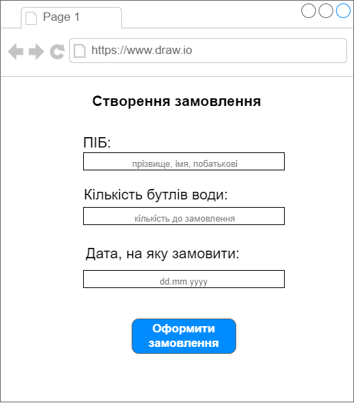
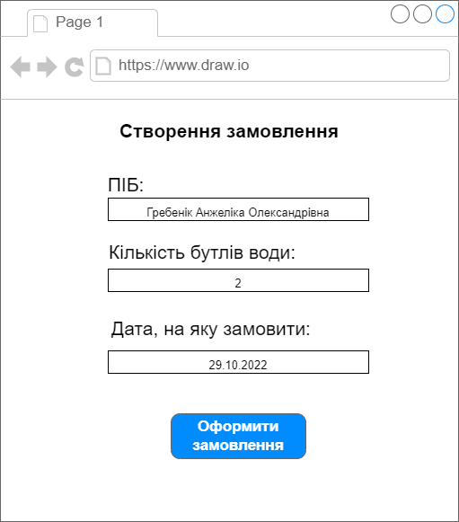
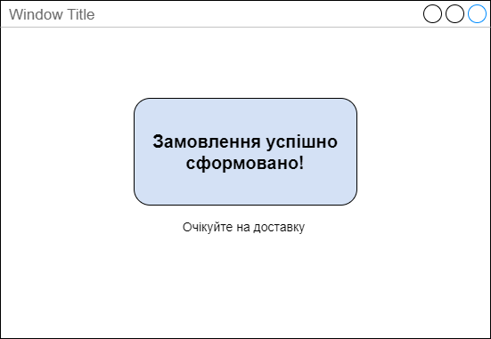

| NFR id |TC id| Опис кроків тестового сценарію                                                                                                                                                                                             |         Опис очікуваних результатів         |
|:------:|:-----:|:---------------------------------------------------------------------------------------------------------------------------------------------------------------------------------------------------------------------------|:-------------------------------------------:|
| FR2.1  |TC 1.6| Початкові умови: відсутні  Кроки сценарію: відсутні                                                                                                                                                                     | Екрана форма:   |
| FR2.1  |TC 1.7| Початкові умови: успішно пройдено TC1.6   Кроки сценарію:  1) В поле full-name внесено - Гребенік Анжеліка Олександрівна   2) В поле count внесено значення "2"   3) В поле date внесено значення "29.10.2022" | Екрана форма:  |
| FR2.1  |TC 1.8| Початкові умови: успішно пройдено TC1.7  Кроки сценарію:  Натиснути кнопку "Оформити замовлення"                                                                                                                     | Екрана форма:  |

